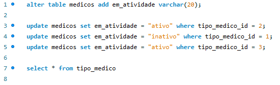

<h1 align='center'>Um projeto de banco de dados de um Hospital!!</h1>

<h2>Analise a seguinte descrição e extraia dela os requisitos para o banco de dados:</h2>

<h3>⚡Parte 1 - Diagrama Entidade Relacionamento (ER)</h3>
<p>
O hospital está em busca de uma solução para gerenciar a área clínica e controlar as consultas realizadas em seu ambiente. Para isso, é necessário um banco de dados que possa armazenar e organizar as informações referentes a pacientes e médicos. 

Os médicos são classificados em três categorias: generalistas, especialistas ou residentes, e suas informações pessoais devem ser registradas em planilhas digitais. É importante destacar que cada médico pode possuir uma ou mais especialidades, sendo elas pediatria, clínica geral, gastroenterologia e dermatologia. Alguns registros antigos ainda estão em formulário de papel e devem ser incluídos no novo sistema.

Os pacientes também precisam ser cadastrados, contendo dados pessoais, documentos e convênios, com informações sobre nome, data de nascimento, endereço, telefone e e-mail. Para cada convênio, é necessário registrar o nome, CNPJ e tempo de carência. As consultas médicas são registradas em planilhas contendo informações sobre a data e hora da consulta, o médico responsável, o paciente, o valor da consulta ou o nome do convêniocom o número da carteira, bem como a especialidade buscada pelo paciente.

Ainda é necessário informatizar a receita médica para que, no final da consulta, o médico possa registrar os medicamentos receitados, a quantidade e as instruções de uso. A partir disso, espera-se que o sistema imprima um relatório da receita ao paciente ou permita sua visualização via internet.
</p>
<br>

<br>
###<h3>⚡Parte 2 - Diagrama Entidade Relacionamento (ER)</h3>
<p>
No hospital, as internações têm sido registradas por meio de formulários eletrônicos que gravam os dados em arquivos. 

Para cada internação, são anotadas a data de entrada, a data prevista de alta e a data efetiva de alta, além da descrição textual dos procedimentos a serem realizados. 

As internações precisam ser vinculadas a quartos, com a numeração e o tipo. 

Cada tipo de quarto tem sua descrição e o seu valor diário (a princípio, o hospital trabalha com apartamentos, quartos duplos e enfermaria).

Também é necessário controlar quais profissionais de enfermaria estarão responsáveis por acompanhar o paciente durante sua internação. Para cada enfermeiro(a), é necessário nome, CPF e registro no conselho de enfermagem (CRE).

A internação, obviamente, é vinculada a um paciente – que pode se internar mais de uma vez no hospital – e a um único médico responsável.
</p>
<br>

<br>
<h3>⚡Parte 3 - Adicionando a tabela </h3>
<p>
<ul>
<li>Inclua ao menos dez médicos de </li>
<li>Ao menos sete especialidades (considere a afirmação de que “entre as especialidades há pediatria, clínica geral, gastroenterologia e dermatologia”).</li>
<li>Inclua ao menos 15 pacientes. </li>
<li>Registre 20 consultas de diferentes pacientes e diferentes médicos (alguns pacientes realizam mais que uma consulta). As consultas devem ter ocorrido entre 01/01/2015 e 01/01/2022. Ao menos dez consultas devem ter receituário com dois ou mais medicamentos. </li>
<li>Inclua ao menos quatro convênios médicos, associe ao menos cinco pacientes e cinco consultas. </li>
<li>Criar entidade de relacionamento entre médico e especialidade.  </li>
<li>Criar Entidade de Relacionamento entre internação e enfermeiro.  </li>
<li>Arrumar a chave estrangeira do relacionamento entre convênio e médico. </li>
<li>Criar entidade entre internação e enfermeiro. </li>
<li>Colocar chaves estrangeira dentro da internação (Chaves Médico e Paciente). </li>
<li>Registre ao menos sete internações. Pelo menos dois pacientes devem ter se internado mais de uma vez. Ao menos três quartos devem ser cadastrados. As internações devem ter ocorrido entre 01/01/2015 e 01/01/2022. </li>
<li>Considerando que “a princípio o hospital trabalha com apartamentos, quartos duplos e enfermaria”, inclua ao menos esses três tipos com valores diferentes. </li>
<li>Inclua dados de dez profissionais de enfermaria. Associe cada internação a ao menos dois enfermeiros. </li>
<li>Os dados de tipo de quarto, convênio e especialidade são essenciais para a operação do sistema e, portanto, devem ser povoados assim que o sistema for instalado. </li>
</ul>
</p>
<br>
<h3>⚡Parte 4 - AlterAndo a tabela </h3>
<br>
<p>
Pensando no banco que já foi criado para o Projeto do Hospital, realize algumas alterações nas tabelas e nos dados usando comandos de atualização e exclusão:

Crie um script que adicione uma coluna “em_atividade” para os médicos, indicando se ele ainda está atuando no hospital ou não. 
</p>


<h3>⚡Parte 4 - Estruturando e testando </h3>

* Todos os dados e o valor médio das consultas do ano de 2020 e das que foram feitas sob convênio.
```
SELECT *, AVG(valor_consulta) 
FROM consulta 
WHERE YEAR(data_hora) = 2020 
GROUP BY id 
LIMIT 1000;
```
* Todos os dados das internações que tiveram data de alta maior que a data prevista para a alta.
```
select * from internacao
where data_alta > data_prev_alta;
```
* Receituário completo da primeira consulta registrada com receituário associado.
```
select * from consulta inner join receita on consulta.id = receita.id inner join paciente 
on paciente.id = consulta.id order by receita.id limit 1;
```
* Todos os dados da consulta de maior valor e também da de menor valor (ambas as consultas não foram realizadas sob convênio).
```
SELECT consulta.*, MAX(consulta.valor_consulta) AS max_valor_consulta, MIN(consulta.valor_consulta) AS min_valor_consulta 
FROM consulta
INNER JOIN paciente ON consulta.paciente_id = paciente.id
WHERE paciente.convenio_id IS NULL
GROUP BY consulta.id;
```
* Todos os dados das internações em seus respectivos quartos, calculando o total da internação a partir do valor de diária do quarto e o número de dias entre a entrada e a alta.
```

```
* Data, procedimento e número de quarto de internações em quartos do tipo “apartamento”.
```

```
* Nome do paciente, data da consulta e especialidade de todas as consultas em que os pacientes eram menores de 18 anos na data da consulta e cuja especialidade não seja “pediatria”, ordenando por data de realização da consulta.
```

```
* Nome do paciente, nome do médico, data da internação e procedimentos das internações realizadas por médicos da especialidade “gastroenterologia”, que tenham acontecido em “enfermaria”.
```

```
* Os nomes dos médicos, seus CRMs e a quantidade de consultas que cada um realizou.
```

```
* Todos os médicos que tenham "Gabriel" no nome. 
```

```
* Os nomes, CREs e número de internações de enfermeiros que participaram de mais de uma internação.
```

```
